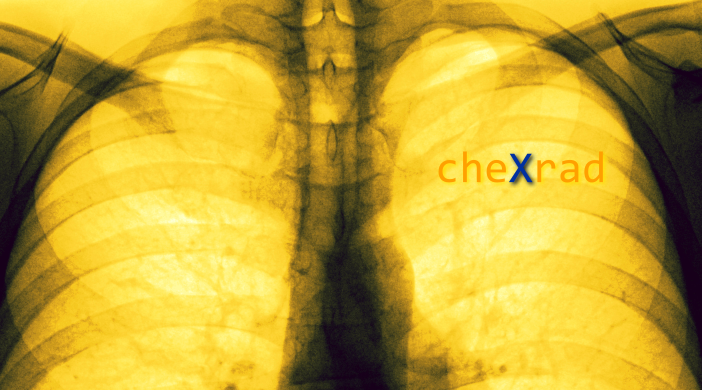

\
[A magyar változatot ide kattintva érheti el.](https://github.com/hyperrixel/cheXrad/blob/master/README-hu.md)

# cheXrad - Pneumonic Analytic CoCoLo-Software

## About the project

The goal of this project is to develop a CoCoLo-software (Compound of Classification only Looked once) to help with pulmonary diagnosis.

## Workflow

The software operates the following way:

- The software receives the chest ` PA ` X-ray image.
- It transforms the image according to the needs of a ResNet network.
- The image is forwarded through the core of the network (ResNet architecture without the final classifier layer).
- The output is forwarded through our classifier networks.
- The result is visualized like a data chain.

## Specifications of the software

### Input image

Input image must be a chest X-ray image. The file format should be ` jpeg ` or ` png `. Additional support for ` DICOM ` is under development. Image size doesn't matter but size higher than 224*224 is recommended to get better results. Image should contain only the ` ROI ` (Region of Interest) area, without extra padding and other unnecessary data.

NOTE: Do not use pictures taken by phone or other camera from screens, monitors or projectors because it affect to the performance negatively. Our model was trained and tested on common, homogenic-quality images from healthcare datasets.

### Image transformer

This part of the software converts the input image according to the needs of the core network. Transformation means resizing and normalization process.

### Core network

The transformed input image is processed by this part of the software first. The core network makes generic processing on the images. It recognizes edges, objects and other common attributes only. The core network is a pretrained headless ResNet model. The use of that kind of a model is very common in image Classification since those models are well trained on generic images so they are good in recognizing visual patterns.

### The classifier networks

The processed data is sent to four different classifier networks. This is a performance improvement since common attributes need to be recognized only once. The classifier networks are trained by us.

#### Classifier#1: healthy - not healthy

#### Classifier#2:

#### Classifier#2:

#### Classifier#2:

### Result visualization

This part of the software is the true user interface (UI). The detailes of the look of this modue depends on the platform where it is used but there are some common attributes as well.

#### Common UI characteristics

#### Platform specific UI details

##### Python script

##### Command line application

##### Android application

## Current state of the project

- [ ] Module#1 (healthy, not-healthy classifier) is under training.
- [ ] Module#2 (2 classes classifier) is under training.
- [ ] Module#3 (3 classes classifier) is under training.
- [ ] Module#4 (15 classes classifier) is under training.

## Sources and references

### Image datasets

The datasets are ordered alphabetically.

#### covid-chestxray-dataset

Published: 2020-02-14\
Contributor(s): [Joseph Paul Cohen: @ieee8023](https://github.com/ieee8023)\
Contact(s): [Joseph Paul Cohen. Postdoctoral Fellow, Mila, University of Montreal](https://josephpcohen.com/)\
Link: [Github repository](https://github.com/ieee8023/covid-chestxray-dataset)\

#### Large Dataset of Labeled Optical Coherence Tomography (OCT) and Chest X-Ray Images

Published: 2018-06-01\
Version: 3\
DOI: 10.17632/rscbjbr9sj.3\
Contributor(s): [Daniel Kermany](https://www.mendeley.com/profiles/daniel-kermany2/), Kang Zhang, Michael Goldbaum\
Link: [dataset](https://data.mendeley.com/datasets/rscbjbr9sj/3)\

#### NIH Chest X-ray Dataset of 14 Common Thorax Disease Categories

Published: 2017-09-27 on [NIH official website](https://www.nih.gov/news-events/news-releases/nih-clinical-center-provides-one-largest-publicly-available-chest-x-ray-datasets-scientific-community)\
Contributor(s): [Ronald M. Summers, M.D., Ph.D.](https://www.cc.nih.gov/drd/summers.html)\
Paper: [ChestX-ray8: Hospital-scale Chest X-ray Database and Benchmarks on Weakly-Supervised Classification and Localization of Common Thorax Diseases](http://openaccess.thecvf.com/content_cvpr_2017/papers/Wang_ChestX-ray8_Hospital-Scale_Chest_CVPR_2017_paper.pdf)\
Paper contributor(s): Xiaosong Wang, Yifan Peng, Le Lu, Zhiyong Lu, Mohammadhadi Bagheri, Ronald M. Summers\
Paper contact(s): {xiaosong.wang,yifan.peng,le.lu,luzh,mohammad.bagheri,rms}@nih.gov\
Download link: [Academic Torrents](http://academictorrents.com/details/e615d3aebce373f1dc8bd9d11064da55bdadede0)\
Download contributor(s): [Joseph Paul Cohen](http://academictorrents.com/userdetails.php?id=14), founder of Academic Torrents\

### Network

#### ResNet - Deep Residual Learning for Image Recognition

Published: 2015-12-10\
Version: v1\
Contributor(s): Kaiming He, Xiangyu Zhang, Shaoqing Ren, Jian Sun\
cs.CV: arXiv:1512.03385v1\
Paper: [Deep Residual Learning for Image Recognition](https://arxiv.org/abs/1512.03385)\
Paper contributor(s): Kaiming He, Xiangyu Zhang, Shaoqing Ren, Jian Sun\
Paper contact(s): {kahe, v-xiangz, v-shren, jiansun}@microsoft.com\
